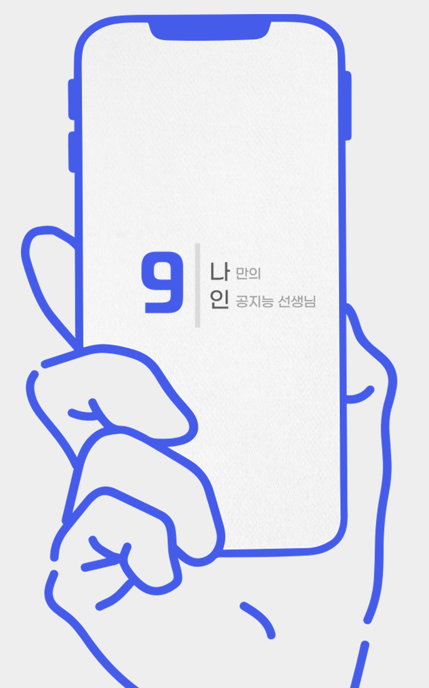

# Nine: 나만의 인공지능 선생님

2023 Chosun Univ. Capston Desgin
넌 학생이고 난 AI야.

 

## 기술 스택

|                           김준현                           |            이성현            |             하태준             |      하태준       |
| :--------------------------------------------------------: | :--------------------------: | :----------------------------: | :---------------: |
|                            팀장                            |             팀원             |              팀원              |       팀원        |
| :--------------------------------------------------------: | :--------------------------: | :----------------------------: | :---------------: |
| GitHub, Notion 전반적인 관리 및 작업, 프로젝트 방향성 설정 | Figma 활용한 프로로타입 구성 | API활용 방안 연구 및 방향 제시 | 프로젝트 문서관리 |

## 프로젝트 소개

  

 
  
 

글로벌 시대에서 영어의 중요성에 대해서는 누구나 인식하고 있으며 대학 진학 및 회사에서 경쟁력을 갖춘
사람으로 거듭나기 위해서는 영어가 필수적인 요소로 작용하는 현대 사회라고 생각합니다.

인공지능 OpenAI 기술을 기반으로 사용자가 풀었고, 틀린 문제나 모르는 문제를 각종 기기로 카메라를 통해 찍거나(OCR 기술 활용) 직접 문제를 적어
올리면 인공지능이 문제를 분석 하여 해당 문제에 따른 해설을 제공합니다.

또한 해당 문제에 대한 분석으로 사용자가 어떤 유형의 문제에 약점이 존재하는지를 파악하고 그 약점에 해당하는 분야의 비슷한 문제들을 여러 추천하는
기능도 포함하여 사용자 의 영어 실력 향상에 확실한 도움을 줄 수 있을 것이라고 확신합니다

 

## 기술 스택

| JavaScript | React Native |  Node   |
| :--------: | :----------: | :-----: |
|   ![js]    |    ![rn]     | ![node] |

## 사용 툴

|  Notion   |  Figma   |
| :-------: | :------: |
| ![notion] | ![figma] |

 

## 구현 기능

### OPENAI API 활용 영어 문제 질의 및 답, 해설 제공

![openai]

### OCR API 활용 카메라로 찍은 이미지를 글로 옮기는 기능 제공

![ocr]

### 대형 플랫폼 간편로그인 API 활용 및 데이터베이스 활용 오답노트 제공

![login]

## 배운 점 & 아쉬운 점

 

## 라이센스

MIT &copy; [준현](https://dduneon.tistory.com)

<!-- Stack Icon Refernces -->

[main]: /images/common/readme-main.png
[ocr]: /images/common/readme-ocr.png
[login]: /images/common/readme-login.png
[openai]: /images/common/readme-openai.png
[js]: /images/stack/javascript.svg
[rn]: /images/stack/react-native.svg
[figma]: /images/stack/figma.svg
[notion]: /images/stack/notion.svg
[node]: /images/stack/node.svg
